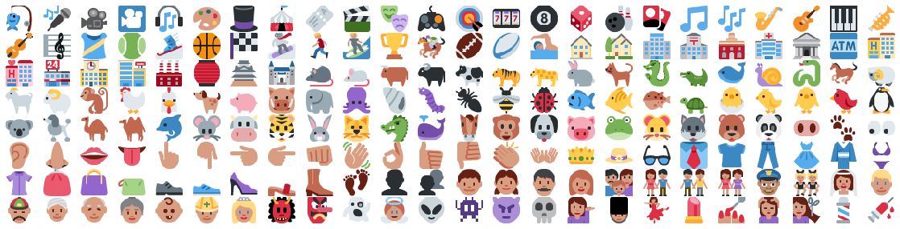

Convolutional variational autoencoders for emoji generation and Siamese text-question-emoji-answer models. Keras, bidirectional LSTMs and snarky tweets [@united](https://twitter.com/united) within.

